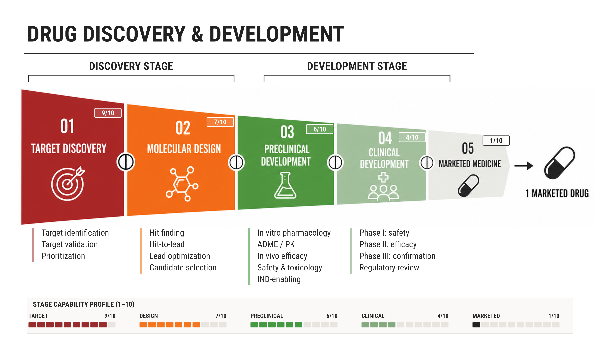

# Drug Discovery & Development Capability Profile

An R-generated 16:9 infographic showing the drug discovery and development
pipeline together with a stage-by-stage capability profile scored from 1–10.



## Outputs

- `drug_discovery_pipeline_4K.png` — UHD 4K PNG (3840 × 2160)
- `drug_discovery_pipeline.svg` — scalable SVG export
- `drug_discovery_pipeline.R` — reproducible R source
- `drug_discovery_pipeline_reference.png` — source process-flow artwork used by the hybrid R composition

## Capability scores

| Stage | Score |
|---|---:|
| Target Discovery | 9/10 |
| Molecular Design | 7/10 |
| Preclinical Development | 6/10 |
| Clinical Development | 4/10 |
| Marketed Medicine | 1/10 |

## Regenerate

The script uses `grid`, `ragg`, `svglite`, `systemfonts`, and `magick`.
From the repository directory, run:

```bash
Rscript drug_discovery_pipeline.R
```

Roboto Condensed font files and their license are included under `fonts/`.

## Edit the figure

The main editable settings are grouped in section 2 of
`drug_discovery_pipeline.R`:

- `stage_details` — descriptions shown below stages 1–4
- `capability$score` — capability scores from 1–10
- `colours` — figure palette
- `pipeline_y_shift` — vertical position of the pipeline group

The R source includes Chinese comments explaining the input files, coordinate
system, drawing functions, and export settings.
